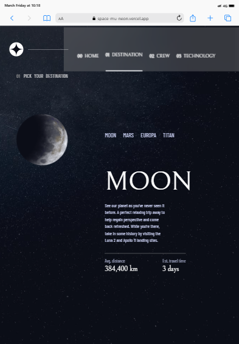
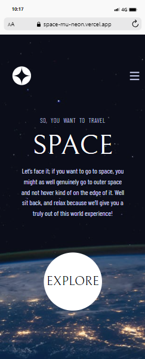
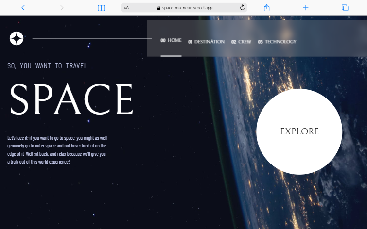

# Frontend Mentor - Space tourism website solution

This is a solution to the [Space tourism website challenge on Frontend Mentor](https://www.frontendmentor.io/challenges/space-tourism-multipage-website-gRWj1URZ3). Frontend Mentor challenges help you improve your coding skills by building realistic projects. 

## Table of contents

- [Overview](#overview)
  - [The challenge](#the-challenge)
  - [Screenshot](#screenshot)
  - [Links](#links)
- [My process](#my-process)
  - [Built with](#built-with)
  - [What I learned](#what-i-learned)
  - [Continued development](#continued-development)
  - [Useful resources](#useful-resources)
- [Author](#author)


**Note: Delete this note and update the table of contents based on what sections you keep.**

## Overview

### The challenge

Users should be able to:

- View the optimal layout for each of the website's pages depending on their device's screen size
- See hover states for all interactive elements on the page
- View each page and be able to toggle between the tabs to see new information

### Screenshot










### Links

- Solution URL: [REPO](https://github.com/NICKY-TECH/space)
- Live Site URL: [HOSTED](https://space-mu-neon.vercel.app/)

## My process


### Built with
- [Tailwind](https://tailwindcss.com/) -  CSS library
- [React](https://reactjs.org/) - JS library
- [Redux](https://redux.js.org/)-State management
- [REACT-DOM](https://www.npmjs.com/package/react-dom)-managing routing within a react app
- [FRAMER-MOTION](https://www.npmjs.com/package/framer-motion)- for animation

### What I learned

I learnt about framer-motion and used it for implementing the animations present in this project

To see how you can add code snippets, see below:

```jsx
    <motion.img src={src} animate={{ rotate:360 }} transition={{ ease:"linear" , duration:3,repeat:Infinity }} className="absoluete top-0"/>
```

### Continued development

I want to learn more about framer-motion and its limitless possibilities.

### Useful resources

- [FRAMER-MOTION](https://www.framer.com/motion/) - This documentation helped me understand framer-motion and its implementation process


## Author

- GITHUB - [JUSTINA](https://github.com/NICKY-TECH)


